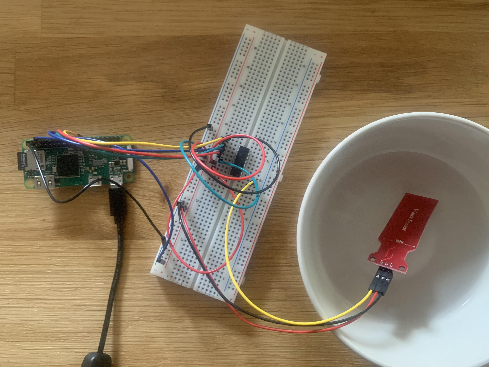
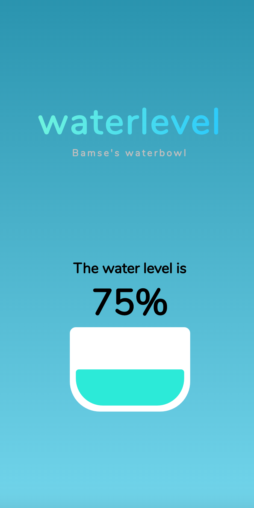

# u11-fullstack-js-esraod

~ *Esra Oktav [2020/08/15]*

</br>

~ *In memory of my dog Bamse* ~

</br>

------------------------------
</br>

## The Idea
Creating a waterlevel sensor that works with a raspberry pi zero to show the current water level of my dogs water bowl and log it, using
using MERN (MongoDB, Express, React.js, node.js)
</br>
#### Stack
- **M**ongoDB
- **E**xpress
- **R**eact.js
- **N**ode.js
- Python
</br>

#### Task Goals
- Show precetage of the water level.
- Log the water level.
- Working on *several* web browsers and devices (both on desktop and mobile).
- Responsive (Should work to use on *every* devices).
</br>

## Raspberry PI Components 

- [Raspberry Pi Zero WH](https://www.electrokit.com/en/product/raspberry-pi-zero-wh-board-with-header-2/)
- [Jumper wires 1-pin male-male](https://www.electrokit.com/en/product/jumper-wires-1-pin-male-male-150mm-10-pack/)
- [Jumper wires 1-pin male-female](https://www.electrokit.com/en/product/jumper-wires-1-pin-male-female-150mm-10-pack/)
- [MCP3008](https://www.electrokit.com/en/product/mcp3008-i-p-dip-16-adc-8-ch-10-bit-spi/)
- [Breadboard](https://www.electrokit.com/en/product/solderless-breadboard-840-tie-points-2/)
- [USB-cable - microUSB](https://www.electrokit.com/en/product/usb-kabel-med-strombrytare-microusb-2/)
- [Memory card micro SDHC 8GB](https://www.electrokit.com/en/product/memory-card-microsdhc-8gb/)
- [water level sensor](https://www.kjell.com/se/produkter/el-verktyg/arduino/tillbehor/luxorparts-vattensensor-for-arduino-p87889)


</br>



</br>


## How to run it


1. Clone the repo
```
git clone https://github.com/chas-academy/u11-fullstack-js-esraod.git
```
</br>

2. Setup and install backend 
  ```
  cd backend
  npm install
  ```
Then Setup MongoDB
using MongoDB locally or using MongoDB Atlas. 
</br>
Change the url in backend/index.js on line 13,

```
mongoose.set('useFindAndModify', false);
mongoose.connect(
  '[Replace this with the url]',
  { useNewUrlParser: true }
);
```

</br>

3. Install packages 
```
cd frontend
npm install
```
</br>

4. Run the backend

```
cd backend
npm run start
```
</br>

5. Run the view/frontend

```
cd frontend 
npm run start
```


## Result 
-----------------




</br>

#### Future Extra Challanges:
- [ ] Notifications to mobile when the water level reaches a certain level.
- [ ] Water level shown visually.
</br>

### Author
**Esra Oktav**

- github/
[esraod](https://www.github.com/esraod) :octocat:


-------------------------------------------------------
2020
